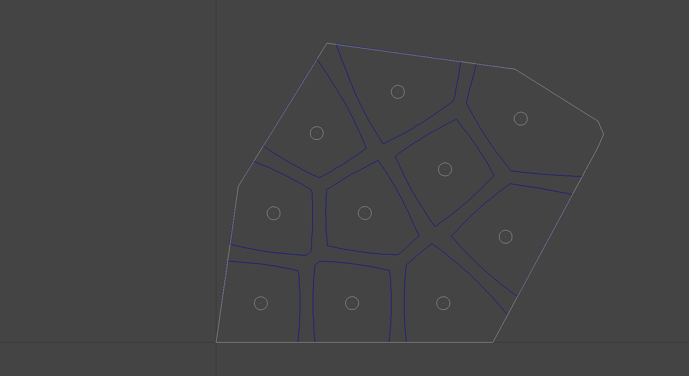
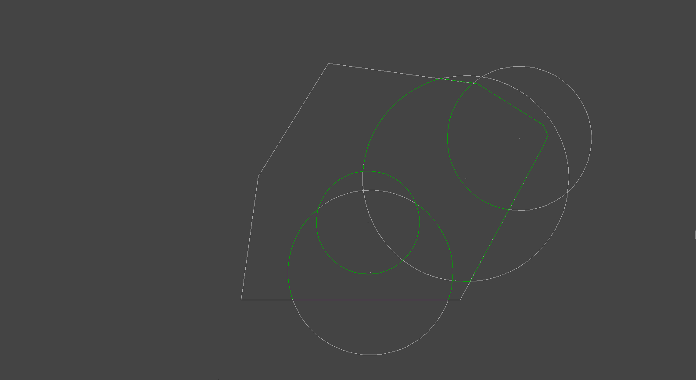

# NPart
A C++ library implementing various 2D partitioning schemes, such as Voronoi and
Guaranteed Voronoi for use in multi-robot navigation and area coverage.
Included is NPSDL, a library to plot the resulting partitions using SDL 2.0.

## Installation
Use the provided CMakeLists.txt. In order to use NPSDL, SDL 2.0 libraries must be present in the system. To install them on Ubuntu:

`sudo apt install libsdl2-dev`

The provided Makefile can be used to compile (make release / make debug) and
install (make install) the libraries as well as some test executables on Linux systems.

## Screenshots
 

## NPSDL Usage
|Function   |Key                   |
|:----------:|:--------------------------:|
|Move view		|Arrow keys
|Zoom in        |=
|Zoom out       |\-
|Reset view     |R
|Quit          	|Q

## License
Distributed under the [GNU General Public License version 3](LICENSE.txt).
 
Copyright © 2016 Sotiris Papatheodorou
 
 
NPart uses [Clipper](http://angusj.com/delphi/clipper.php) and [SDL](https://www.libsdl.org/).
