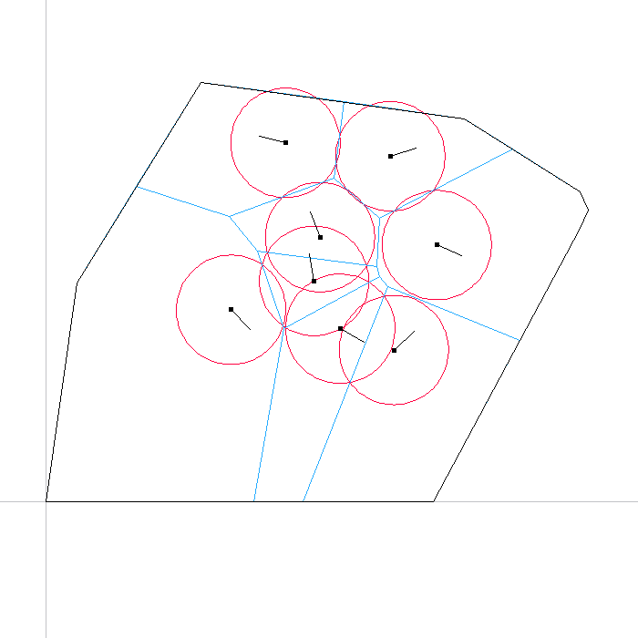
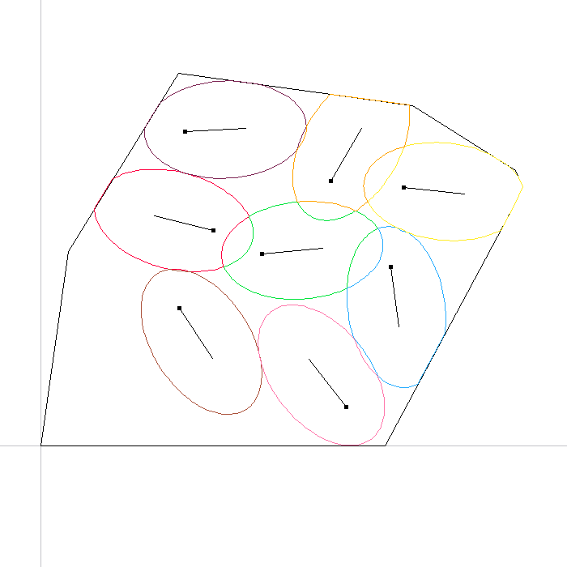
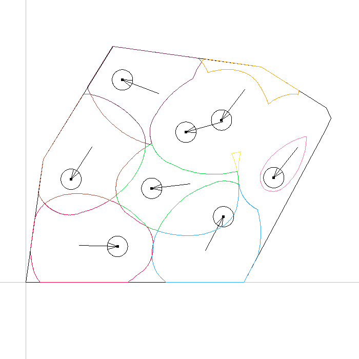

# NRobot
A C++ library of algorithms for area coverage by a network of mobile robotic
agents.

Supported agent kinematic models include simplified single integrator models
for the position and optionally orientation of ground agents as well as a
differential drive agent model.

Supported partitioning schemes include Voronoi, Guaranteed Voronoi,
Additively Weighted Guaranteed Voronoi as well as the partitioning scheme
proposed in [R1], while extending it to take positioning and orientation
uncertainty into account.

Implemented control laws include move towards the centroid, move towards the
r-limited centroid, a gradient ascent control law for homogeneous agents and
the control law proposed in [R1], which has also been extended for cases with
positioning and orientation uncertainty.

If SDL 2 is present on the system and the variable `NR_PLOT_ENABLE` is set to 1
in `CMakeLists.txt`, NRobot will be able to provide real-time plots of the
simulation state with the ability to pan and zoom.

The library can be extended for aerial agents and various other partitioning
schemes, control laws or agent kinematic models.

## Screenshots
Screenshots of the NRobot plot functionality using SDL 2.

 
 

## Compilation
NRobot uses CMake for the build process. To compile the library as well as some
testing and example simulations run
```
cmake -H. -Bbuild/release -DCMAKE_BUILD_TYPE=Release
cmake --build build/release -- -j3
```

If you also have `make` installed, you can simply do
```
make release
```

## File Formats
A description of the file formats used when data is imported and exported can be found in [`docs/file_formats.md`](./docs/file_formats.md). All files used are simple ASCII text files.

## Relevant Publications
[P1] S. Papatheodorou, Y. Stergiopoulos, and A. Tzes, [*Distributed area coverage control with imprecise robot localization*](http://ieeexplore.ieee.org/document/7535920/), In Proceedings of the 24th Mediterranean Conference on Control and Automation (MED), pp. 214-219, June 21-24, 2016, Athens, Greece

[P2] S. Papatheodorou, A. Tzes and K. Giannousakis, [*Experimental Studies on Distributed Control for Area Coverage using Mobile Robots*](https://doi.org/10.1109/MED.2017.7984198), In Proceedings of the 25th Mediterranean Conference on Control and Automation (MED), pp. 690-695, July 3-6, 2017, Valletta, Malta

[P3] S. Papatheodorou, A. Tzes, and Y. Stergiopoulos, [*Collaborative Visual Area Coverage*](https://doi.org/10.1016/j.robot.2017.03.005), Robotics and Autonomous Systems, ISSN 0921-8890, Volume 92, June 2017, Pages 126–138, Elsevier

[P4] S. Papatheodorou and A. Tzes, *Cooperative Visual Convex Area Coverage using a Tessellation-free strategy*, In Proceedings of the 56th IEEE Conference on Decision and Control (CDC) 2017, December 12-15, 2017, Melbourne, Australia [Accepted]

## References
[R1] Y. Stergiopoulos and A. Tzes, *Cooperative positioning/orientation control of mobile heterogeneous anisotropic sensor networks for area coverage*, In Proceedings of the 2014 IEEE International Conference on Robotics and Automation (ICRA), pp. 1106-1111, May 31 - June 7, 2014, Hong Kong, China

[R2] J. J. Jimenez, F. R. Feito, and R. J. Segura, [*Robust and Optimized Algorithms for the Point‐in‐Polygon Inclusion Test without Pre‐processing*](https://doi.org/10.1111/j.1467-8659.2009.01481.x), Computer Graphics Forum, ISSN 1467-8659, Volume 28, Issue 8, December 2009, Pages 2264–2274, Blackwell.

## License
Distributed under the [GNU General Public License version 3](LICENSE.txt).
<br>
Copyright © 2016-2017 Sotiris Papatheodorou
<br>
<br>
NRobot uses [Clipper 6.4.2](http://angusj.com/delphi/clipper.php) and
[SDL 2](https://www.libsdl.org/). Symbolic math is done through
[SymPy](http://www.sympy.org/en/index.html).
